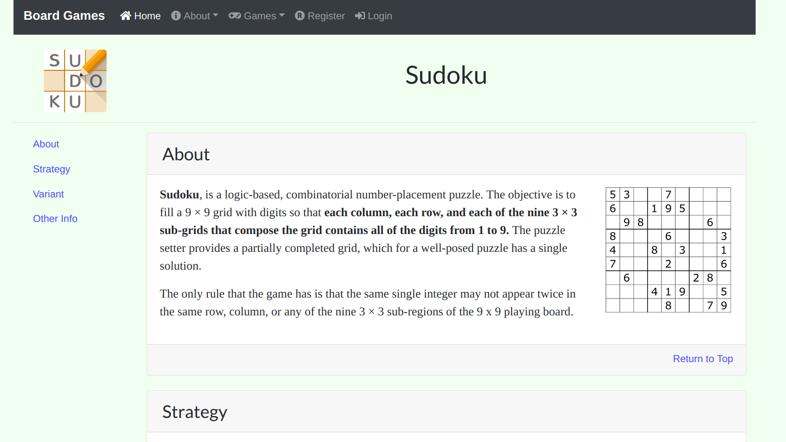

# PyBoardGame

## About
This website is a collection of board games written in Python 3.6 with the Flask
web framework.

https://pyboardgame.herokuapp.com/

## Features
Here is a list of features that will be implemented:
- [ ] A secure database user authentication.
- [x] A complete description of the games as well as links for further information
- A number of simple board games for users to play:
    - [x] Tic Tac Toe
    - [ ] 2048
    - [x] Sudoko
    - [ ] Blackjack
    - [ ] Etc.

Here is a list of features that might be implemented:
- A leveling and coin system

## Screenshots
Here are some screenshot of the website:

**_Home Page:_**

**_About Page (All About page looks the same):_**

**_Tic Tac Toe:_**

**_Sudoku:_**

